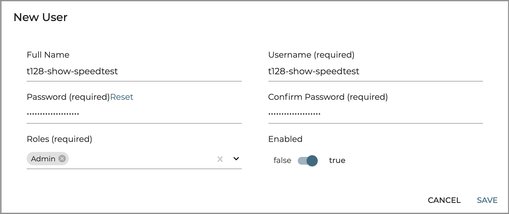

# t128-show-speedtest
This script is designed to run on a 128T conductor.
When executed (e.g. regularly via a cronjob) it triggers a speedtest on configured interfaces of all attached 128T routers.

Results of the speedtest measurements are written to the router's `description` field inside the 128T config and can be viewed using the conductor web UI.

# Installation
On the conductor apply the salt-state `setup-show-speedtest.sls`:

```
$ t128-salt '*' state.apply setup-show-speedtest
```
This installs `speedtest` on all attached routers.

To install the main script run on the conductor:

```
$ cd /srv/salt
$ cp files/t128-show-speedtest.py /usr/sbin
$ cp files/t128-show-speedtest.config /etc
```
A cronjob which runs the speedtest measurements nightly at 03:00 looks like:

```
$ crontab -l
0 3 * * * /usr/sbin/t128-show-speedtest.py -c /etc/t128-show-speedtest.config
```

# Configuration
## REST API Key
It is recommended to create a dedicated 128T user account for this key, e.g. `t128-show-speedtest`.



Afterwards run this API call in order to retrieve the API key:

```
$ curl -X POST "https://<conductor-fqdn>/api/v1/login" \
-H "accept: application/JSON" \
-H "Content-Type: application/json" \
-d "{ \"username\": \"t128-show-speedtest\", \"password\": \"secret\"}"
```
The API key starts with `eyJhbGciOiJSUzI1NiIs...`

## Script Configuration
Once a REST API key has been generated, copy it to the config file `/etc/t128-show-speedtest.config` (which is in json format) to `api_key`:

```
{
    "api_key": "eyJhbGciOiJSUzI1NiIs...",
    "default_interfaces": [
...
```

The `default_interfaces` list is used by the script to identify the device-interface which is connected to the internet and has a default (service) route.
The `speedtest` tool automatically finds the best server to be used for measurements.

In order to measure additional device-interfaces specify the name of the interface followed by a speedtest server id.
Available server ids can be retrieved using `speedtest` on a router:
 
```
$ speedtest --servers
```

```
...
    "extra_interfaces": {
        "MPLS": "30907",
        "DSL2": "30593"
    }
...
```   


## 128T Service Configuration
For using the default internet interface the local Linux system has to be able to access the internet.
Normally, this requires a `host` interface, e.g. Loopback and a tenant assigned to it, e.g. `128t-management`.
This tenant has to be added to the service representing the internet and a corresponding service route.
The relevant 128T config extract may look like this:

```
config
    authority

        router  sample-router
            node  sample-router
                device-interface  WAN
                    network-interface  WAN
                        source-nat             true
                        dhcp                   v4
                    exit
                exit
                device-interface  Loopback
                    type               host
                    network-interface  Loopback
                        default-route      true
                        tenant             128t-management
                        source-nat         true
                        management-vector
                            priority  200
                        exit
                        address            169.254.20.1
                            ip-address     169.254.20.1
                            prefix-length  30
                            gateway        169.254.20.2
                        exit
                    exit
                exit
            exit
            service-route  Internet
                service-name  Internet
                next-hop      sample-router WAN
                    node-name  sample-router
                    interface  WAN
                exit
            exit
        exit

        service  Internet
            description           "The Internet"
            address               0.0.0.0/0
            access-policy         128t-management
                source      128t-management
                permission  allow
            exit
            share-service-routes  false
        exit
    exit
exit
```

Also ensure there is a valid DNS configuration on all routers. e.g.:

```
$ cat /etc/resolv.conf
nameserver 1.1.1.1
nameserver 8.8.8.8
```

### Additional Interfaces

For additional interface measurements another service and service-route is needed for each interface. For example server id `30593` resolves to `speed1.syseleven.net` with IP address `37.49.159.242`.

```
$ speedtest -f json --server-id=30593 | python -m json.tool | grep host
         "host": "speed1.syseleven.net:8080",
```

```
config
    authority

        router  sample-router
            node  sample-router
                device-interface  MPLS
                    network-interface  MPLS
                        source-nat             true
                        dhcp                   v4
                    exit
                exit
            exit
            service-route  Speedtest-30593
                service-name  Speedtest-30593
                next-hop      sample-router MPLS
                    node-name  sample-router
                    interface  MPLS
                exit
            exit
        exit

        service  Speedtest-30593
            description           "Service to route speedtest to 30593 via MPLS"
            address               speed1.syseleven.net
            access-policy         128t-management
                source      128t-management
                permission  allow
            exit
            share-service-routes  false
        exit
    exit
exit
```
